# Satisfiability checking

Command line tool for SAT solving, SMT solving in various theories, and other algorithms related to satisfiability checking.

The techniques used here are introduced in the RWTH University
lecture '[Satisfiability checking](https://ths.rwth-aachen.de/teaching/winter-term-2021-2022/lecture-satisfiability-checking/)'
by Prof. Dr. Erika Ábrahám.

# How to build and run the project

Clone the git repository:  
`git clone https://github.com/paultristanwagner/satisfiability-checking.git`  
Navigate into the created directory:  
`cd satisfiability-checking`  
Let Maven build the project:  
`mvn package`  
Run the project:  
`java -jar target/satchecking-1.0-SNAPSHOT.jar`  
Now you should see the command prompt indicated by a `>` symbol.

# Propositional logic

A SAT solver is implemented that can
employ [DPLL+CDCL](https://en.wikipedia.org/wiki/Conflict-driven_clause_learning), [DPLL](https://en.wikipedia.org/wiki/DPLL_algorithm)
as well as simple enumeration to solve propositional logic problems.

Input can be given in conjunctive normal form in the following way.

  
  

# Tseitin's transformation

The Tseitin transformation is implemented for propositional logic.
It can be used to transform a formula into an equi-satisfiable formula in conjunctive normal form.
The logical operators '~', '&', '|', '->', '<->' as well as parentheses are supported.

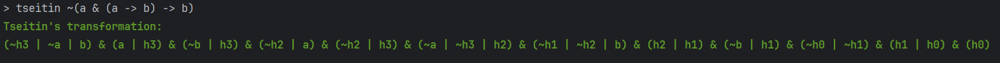  

# SMT solver

An SMT solver is implemented for linear real arithmetic (QF_LRA), linear integer arithmetic (QF_LIA), equality logic (
QF_EQ) and equality logic with
uninterpreted functions (QF_EQUF).

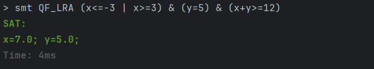  
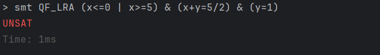  

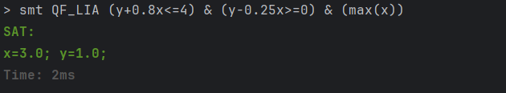  
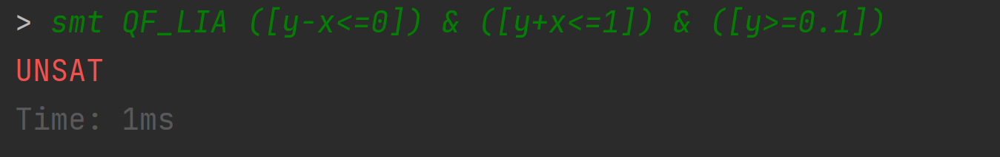  

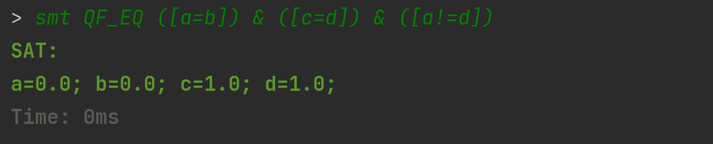  
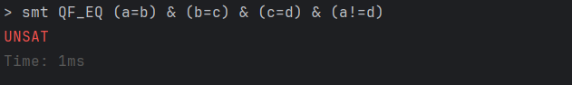  

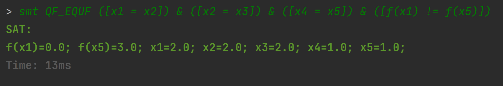  
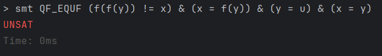  

# Theory solvers

## Linear real arithmetic (QF_LRA)

The program can check sets of weak linear constraints for satisfiability employing
the [Simplex algorithm](https://en.wikipedia.org/wiki/Simplex_algorithm).  
If the set of constraints is satisfiable, the program will print a satisfying assignment.
Otherwise, an explanation for unsatisfiability is given in the form of an infeasible subset.
Currently, the program supports decimal coefficients which will be handled via floating point arithmetic.

### Examples

  
  

An optional objective function can be given to maximize or minimize the value of a linear expression.

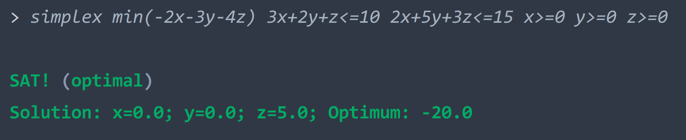  
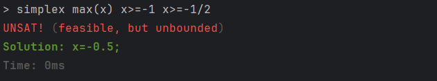  
