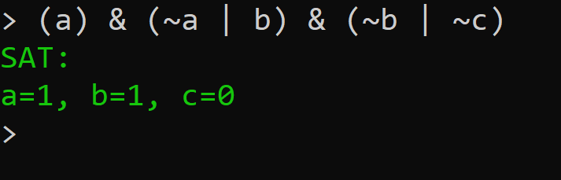
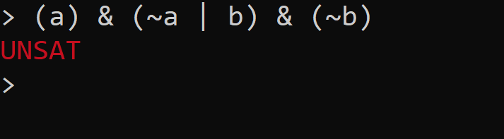

# Satisfiability checking
This project is supposed to be a practice environment to implement algorithms related to satisfiability checking.
The techniques used here are introduced in the RWTH University lecture '[Satisfiability checking](https://ths.rwth-aachen.de/teaching/winter-term-2021-2022/lecture-satisfiability-checking/)' by Prof. Dr. Erika Ábrahám.

# How to build and run the project
Clone the git repository:  
`git clone https://github.com/paultristanwagner/satisfiability-checking.git`  
Navigate into the created directory:  
`cd satisfiability-checking`  
Let Maven build the project:  
`mvn package`  
Run the project:  
`java -jar target/satchecking-1.0-SNAPSHOT.jar`  
Now you should see the command prompt indicated by a `>` symbol.

# Propositional logic
## Enumeration
A simple SAT solver using enumeration is implemented.

## DPLL
The [DPLL Algorithm](https://en.wikipedia.org/wiki/DPLL_algorithm) is implemented.

## DPLL+CDCL
A [DPLL+CDCL](https://en.wikipedia.org/wiki/Conflict-driven_clause_learning) solver that applies conflict resolution is used by the command line interface.

### Example:
Input can be given in conjunctive normal form in the following way.

  
  
